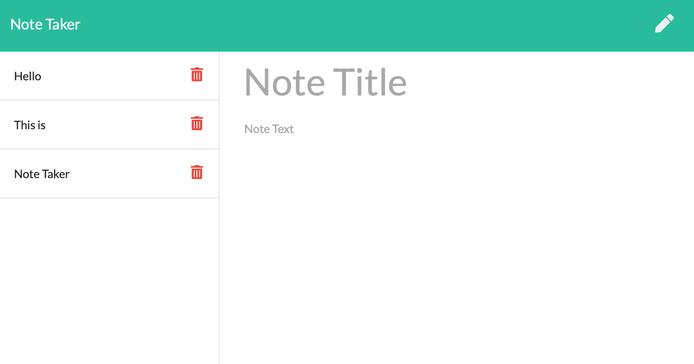

<h1 align="center">Note Taker</h1>



Click to deploy [here](https://eduardo-notetaker.herokuapp.com/).


<br />
## Description
🔍 An application that can be used to write, save, and delete notes. 
## Table of Contents
- [Description](#description)
- [License](#license)
- [Installation](#Installation)
- [Contributing](#contributing)
- [Tests](#Tests)
## Installation
```bash
npm install

```
## Usage
```bash
node server.js

```

https://eduardo-notetaker.herokuapp.com/

## Tests

## License

<br />
This application is covered by the MIT license. 
## Contributing
Eddie Ibarra
<br />
:octocat: Find me on GitHub: [ibarrasb](https://github.com/ibarrasb)<br />
<br />
✉Email me with any questions: eddieibarra43@gmail.com<br /><br />
